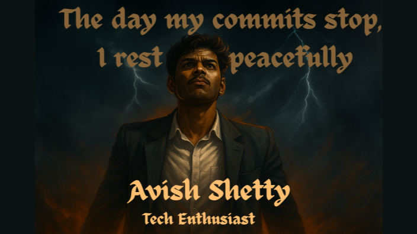

  

  

<h2 style="color:red;">🦁 About Me</h2> 
 I am a developer with a strong interest in building reliable, user-focused applications. I’m currently working on <b>Valura</b>, where I focus on transforming ideas into scalable and maintainable solutions. My learning journey is centered around <b>system design</b> and <b>application development</b>. 
 
 I primarily work with <b>React</b>, <b>C++</b>, and I enjoy solving complex problems by breaking them down into simple, logical components.
 
 Alongside technical skills, I bring a creative mindset shaped by experience in storytelling and stage performance. This helps me approach development with a strong sense of flow, communication, and user experience. 
 
 📫 <b>Contact:</b> <a href="mailto:avish.vijay2021@gmail.com">avish.vijay2021@gmail.com</a> 

## 🌐 Socials:
   

# 💻 Tech Stack:
               

# 📊 GitHub Stats:

