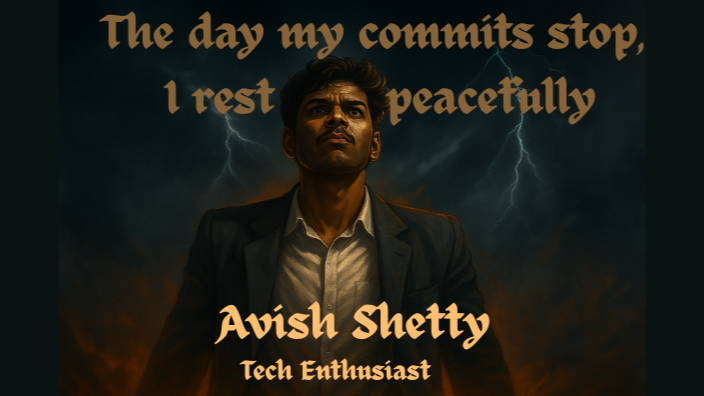

  

<h1 align="center">
  About
   Me
</h1>

  I am a developer with a strong interest in building reliable, user-focused applications.
  I’m currently working on <b style="color:#FF0000;">Valura AI</b>, where I focus on transforming ideas into scalable and maintainable solutions.
  My learning journey is centered around <b style="color:#FF0000;">system design</b> and <b style="color:#FF0000;">application development</b>.

  I primarily work with <b style="color:#0000FF;">React</b>, <b style="color:#0000FF;">C++</b>, and I enjoy solving complex problems by breaking them down into simple, logical components.

  Alongside technical skills, I bring a creative mindset shaped by experience in storytelling and stage performance.
  This helps me approach development with a strong sense of flow, communication, and user experience.

  <b>Contact:</b>
  <a href="mailto:avish.vijay2021@gmail.com" style="color:#0000FF;">
    avish.vijay2021@gmail.com
  </a>

 

# Socials

  

  

# Tech Stack

  

